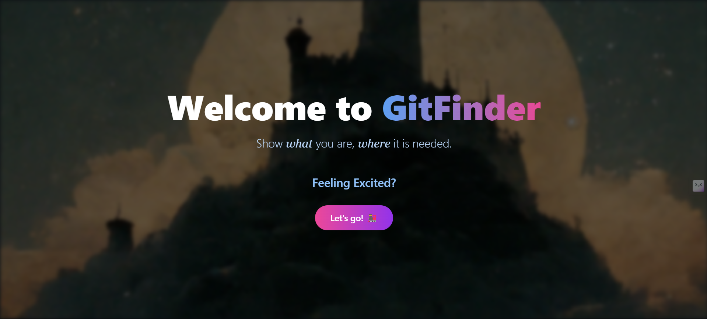

# <p align="center">Git-Finder</p>

<p align="center">
  
</p>


<div align="center">
  <p>
    <a href="https://github.com/ellerbrock/open-source-badges/">
      
    </a>
    
    
    
    
    
    
    
    
    
    
    
    
  </p>
</div>

<div>
  <h2>Table of Contents</h2>
  <ul>
    <li><a href="#about-fitflex">About GitFinder</a></li>
    <li><a href="#tech-stack">Tech Stack</a></li>
    <li><a href="#what-can-you-contribute">What can you contribute?</a></li>
    <li><a href="#how-to-contribute">How to contribute?</a></li>
    <li><a href="#how-to-make-a-pull-request">How to make a pull request?</a></li>
    <li><a href="#project-contributors">Project Contributors</a></li>
    <li><a href="#license">License</a></li>
</ul>
  
<h2>📌 Open Source Program</h2>

<h3> This project is now OFFICIALLY accepted for</h3>

  
  


  <h2 id="about-fitflex">About Git-Finder</h2>
 GitHub Finder is a social platform that leverages GitHub authentication to provide users with a space to share their thoughts, ideas, and insights with the developer community. Users can post updates, interact with others, and explore GitHub profiles of fellow users.

# Tech-Stack

<p align="center">
   
   
  

</p>

## Features

### 1. GitHub Authentication

- Users can log in securely using their GitHub credentials.
- OAuth integration ensures a seamless and secure authentication process.

### 2. Post Thoughts

- Share your latest discoveries, thoughts, or challenges with the community.
- Post updates in a format similar to popular social media platforms.

### 3. Explore GitHub Profiles

- Search for other GitHub users and explore their profiles.
- View GitHub contribution graphs to understand their coding activity over time.
- Explore repositories and projects associated with each user.

### 4. Connect with Developers

- Follow other GitHub users to stay updated on their activities.
- Like, comment, and engage with posts to foster a vibrant developer community.

Whether you're looking to build your professional network, seek feedback on projects, or simply stay in touch with fellow coders, GitHub Finder creates an engaging space for developers of all levels.

<h2 id="what-can-you-contribute">What can you contribute?</h2>

- Find All the details in [**CONTRIBUTING.md**](https://github.com/BamaCharanChhandogi/GitFinder/blob/main/CONTRIBUTING.md) before contributing
- Please follow guidelines in [**Code_of_Conduct.md**](https://github.com/BamaCharanChhandogi/GitFinder/blob/main/Code_Of_Conduct.md)

<h2 id="how-to-contribute">How to contribute?</h2>

- Drop a Star in this repo
- Take a look at the existing [Issues](https://github.com/BamaCharanChhandogi/GitFinder/issues).
- Fork the Repo create a branch for any issue that you are working on and commit your work.
- At first raise an issue in which you want to work
- **Please do not make more than 2 issues at a time , Once your PR have been merged only then go for the next issue**
- **Then when you are get assigned only then work on that issue & make a PR**
- Please try to make a separate branch in your fork in case of PR
- Create a [**Pull Request**](https://github.com/BamaCharanChhandogi/GitFinder/pulls), which will be promptly reviewed and given suggestions for improvements by the community.
- **REMINDER: Commit inside **the `Projects`** Folder**
- Find the already Existing Projects in the `Projects` Folder
- Add screenshots or video prototypes to your Pull Request to help us understand the effects of the changes that are included in your commits.

<h2> Installation and Setup</h2>

<h3> Prerequisites</h3>

- Node.js
- npm

<h3> Steps</h3>

1. **Clone the repository**:
   ```bash
   git clone https://github.com/<your-github-username>/GitFinder.git
   ```
2. **Navigate to the project directory**:
    ```bash
   cd GitFinder
   ```
  
3. **Install Dependencies**:
    ```bash
   npm install
   ```
4. **Run the project**:
   ```bash
   npm run dev
   ```
5. **Contribution Guidelines**
Move detailed steps to a new `CONTRIBUTING.md` file and link to it:


<p align="right"><a href="#top"></a></p>

<h2 id="how-to-make-a-pull-request">How to make a Pull Request?</h2>


**1.** Start by forking the [**GitFinder**](https://github.com/BamaCharanChhandogi/GitFinder) repository. Click on the <a href="https://github.com/Open-Code-Crafters/GitFinder/fork"></a> symbol at the top right corner.

**2.** Clone your forked repository:

```bash
git clone https://github.com/<your-github-username>/GitFinder
```

**3.** Navigate to the new project directory:

```bash
cd GitFinder
```

**4.** Set upstream command:

```bash
git remote add upstream https://github.com/BamaCharanChhandogi/GitFinder
```

**5.** Create a new branch:

```bash
git checkout -b YourBranchName
```

<i>or</i>

```bash
git branch YourBranchName
git switch YourBranchName
```

**6.** Sync your fork or local repository with the origin repository:

- In your forked repository click on `Fetch upstream`.
- Click `Fetch and merge`.

<h3> Alternatively, Git CLI way to Sync forked repository with origin repository:</h3>

```bash
git fetch upstream
```

```bash
git merge upstream/main
```

<h3 id="github-docs-syncing">Github Docs for Syncing</h3>
<a href="https://docs.github.com/en/github/collaborating-with-pull-requests/addressing-merge-conflicts/resolving-a-merge-conflict-on-github">Read the documentation</a>

**7.** Make your changes to the source code.

**8.** Stage your changes and commit:

⚠️ **Make sure** not to commit `package.json` or `package-lock.json` file

⚠️ **Make sure** not to run the commands `git add .` or `git add *`. Instead, stage your changes for each file/folder

```bash
git add file/folder
```

```bash
git commit -m "<your_commit_message>"
```

**9.** Push your local commits to the remote repository:

```bash
git push origin YourBranchName
```

**10.** Create a [Pull Request](https://help.github.com/en/github/collaborating-with-issues-and-pull-requests/creating-a-pull-request)!

**Congratulations! You've made your first contribution!** 🙌🏼

<p align="right"><a href="#top"></a></p>

<h2 id="project-contributors">Project Contributors</h2>

<p align ="center">
  
</p>
<div align="center">
<a  href="https://github.com/BamaCharanChhandogi/GitFinder/graphs/contributors">
  
</a> 


 
# License


<div align="center">
</br>
<p align = "center">
Show some ❤️&nbsp; by giving  to this repo
</p>

<p align="right"><a href="#top"></a></p>


